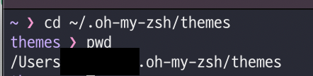
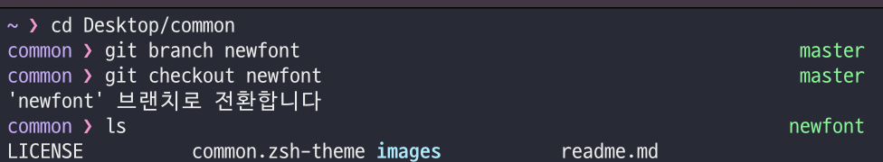

brew 오류로 맥북을 초기화하고 다시 환경설정하는 시간을 가졌다..  
개발하다보면 은근 초기화 할 일이 꽤 생기기 때문에 내가 좋아하는 zsh 테마를 설정하는 방법을 정리해놓고 참고해서 봐야겠다 😃

기본 테마들 중에서는 내 마음에 쏙 드는 테마가 없어 열심히 찾아보았다 ㅎㅎ  
먼저 내가 좋아하는 테마는
[common theme](https://github.com/jackharrisonsherlock/common)

되게 깔끔해서 보기 좋다는 점!  
Iterm2와 OH-MY-ZSH를 설치한 뒤 설정 방법이므로 미리 설치해두도록 한다.  


먼저 테마소스를 clone 해주고 바로 아래 과정으로 테마 파일을 옮길 경로를 가져온다.

```
git clone https://github.com/jackharrisonsherlock/common.git

cd ~/.oh-my-zsh/themes
pwd 
```
  
사진과 같이 경로가 뜬다. 저거 복사해서 common.zsh-theme 옮겨줄 때 사용하면 된당!  
```
cp common.zsh-theme /Users/유저네임/.oh-my-zsh/themes/common.zsh-theme
```
이제 테마 목록에 들어간 테마를 적용하기 위해 zshrc를 편집해준다.  
```
vi ~/.zshrc
```
편집모드로 변경하기 위해 'i'를 누르고  
ZSH_THEME="robbyrussell" 로 되어 있는 부분을  
ZSH_THEME="common"으로 변경하고  
'esc'로 명령모드로 전환하고 ':wq'를 입력해 편집기를 저장 후 종료한다!  

그리구 iterm을 껐다 키면 끝! 🥰  

  


+ 이거 하기 귀찮을 때 사용하는 기본 테마 중 젤 예쁜거  
그냥 vi ~/.zshrc 후 ZSH_THEME="minimal"로 바꾸고 preference -> profiles -> color 들어가서 내맘대로 색깔 조정하기 !!  
하지만 위에꺼가 더 깔끔함 🥺
